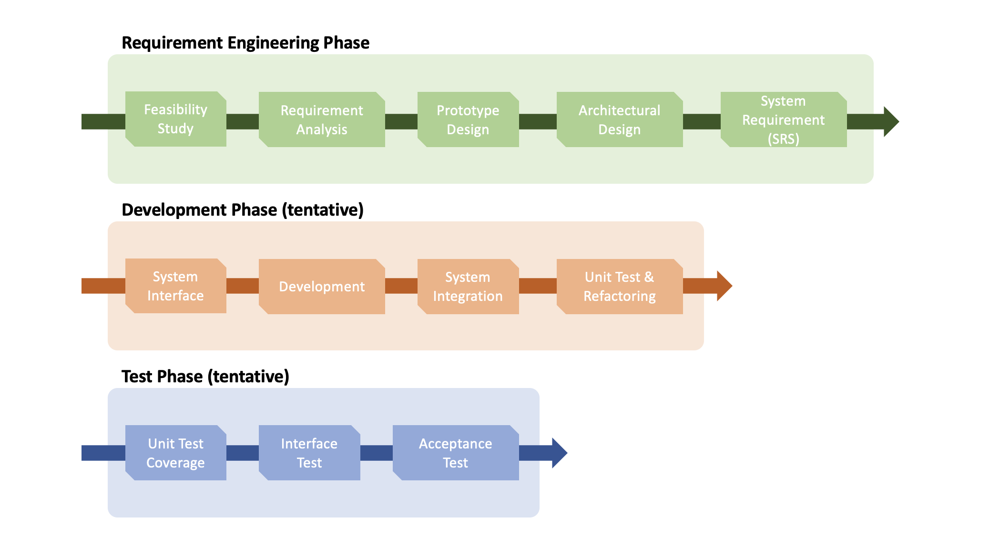
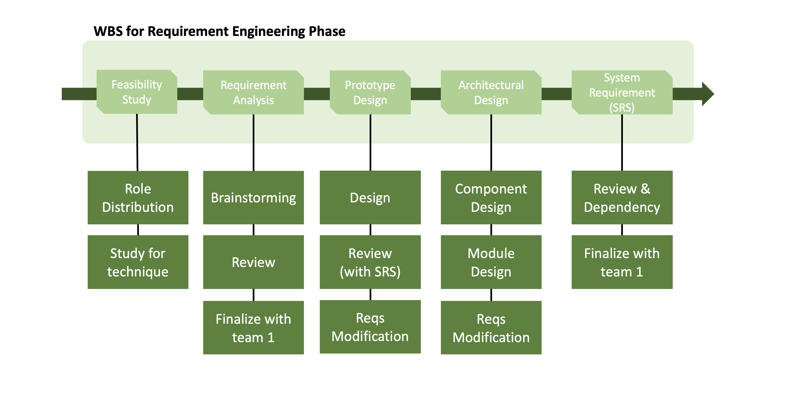

# Project Management

---
### ❓ Who we are

#### Team Name
- `🧭 Navigators`

#### Team Members

 
 
 

### 👋 To Join Us

  

 
 
 

### 🏗 What we build

#### Project Name
- `Trailblazer` (Team 2 version)

#### Motivation
> We can find the path from `N1` to `E3` using Google Map, Naver Map, etc.
>       
> But, we CANNOT find the path from `N1` to `E3 1339 meeting room`.
>
> The main difference from the existing map service is that it is possible to search through `information inside the school building`.

#### Project Goal
> Allow students to select a starting point and destination within the school campus.
>
> It will display the `shortest route` along with the `estimated time` of arrival.

 
 
 

### 🚩 Milestones

#### WBS

##### 1. Requirement Engineering Phase  👈  `we are now here`

 
 
 

### 📃 Documents

* System Requirement Specification `on-going`

* UML

`todo`